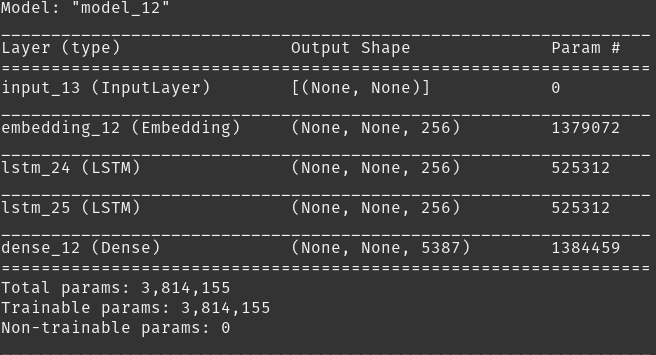

# South Park GANs

## What is a GAN?
  - A GAN is a Generative Adversarial Network.
  - They use Neural Network architechure to generate all kinds of things such as images and text!
  - GANs do not have labels or targets therefore they are a unsupervised machine learning technique.
  - Once trained on text data or images they are ableto generate something that could come close to being in the original dataset.
## GANs used in this project
  - I used two different GAN architectures to generate my text.
  - Both architectures were trained on the same individual character South Park script data
  - The first architecture I used was a simple LSTM neural network.
  - The second was a retrained simple-GPT2
  
## LSTM NN
   
   Format: 
